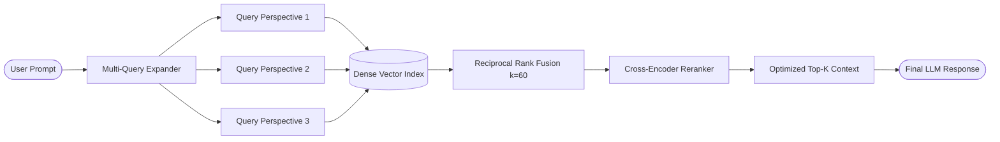

# RAG Fusion Engine

[](https://github.com/txltedxgod/rag-fusion-engine/actions)
[](https://opensource.org/licenses/MIT)
[](https://www.python.org/)
[](https://www.docker.com/)


Production-grade Retrieval-Augmented Generation (RAG) service in Python 3.11 implementing Reciprocal Rank Fusion (RRF) and multi-perspective query expansion.

## Overview




Traditional single-query vector retrieval often fails to capture the full semantic scope of complex user prompts. RAG Fusion Engine overcomes this by:
1. Expanding user queries into multiple semantic viewpoints.
2. Executing parallel vector retrieval across the dense index.
3. Applying **Reciprocal Rank Fusion (RRF)** to score and merge results:

$$\text{RRF}(d) = \sum_{q \in Q} \frac{1}{k + \text{rank}_q(d)}$$

where $k=60$ acts as a ranking stability constant.

## Project Structure

```
├── src/
│   ├── api/v1/          # REST endpoints and request handlers
│   ├── core/            # App settings, logging, and custom exceptions
│   ├── schemas/         # Pydantic v2 data models & validation
│   ├── services/        # Vector indexing and RRF algorithm implementation
│   └── main.py          # FastAPI application factory & lifespan context
├── tests/
│   ├── conftest.py      # Pytest fixtures and test harnesses
│   └── test_fusion.py   # Unit & convergence test suite
├── Dockerfile           # Multi-stage container definition
├── Makefile             # Development automation targets
└── pyproject.toml       # Tooling configs (ruff, mypy, pytest)
```

## Quick Start

### Local Setup
```bash
# 1. Install dependencies
make install

# 2. Run test suite
make test

# 3. Start development server
make run
```

### Docker
```bash
docker compose up -d --build
```

## API Reference

### 1. Ingest Document
```bash
curl -X POST "http://localhost:8000/api/v1/documents" \
  -H "Content-Type: application/json" \
  -d '{
    "text": "PostgreSQL 16 introduces enhanced parallel query execution for hash joins.",
    "metadata": {"category": "database", "version": "16"}
  }'
```

### 2. Multi-Query RAG Search
```bash
curl -X POST "http://localhost:8000/api/v1/search" \
  -H "Content-Type: application/json" \
  -d '{
    "query": "PostgreSQL query performance tuning",
    "top_k": 3,
    "num_queries": 3
  }'
```

## Development & Linting
```bash
make lint    # Run ruff & mypy checks
make format  # Auto-format codebase
```

## License
MIT